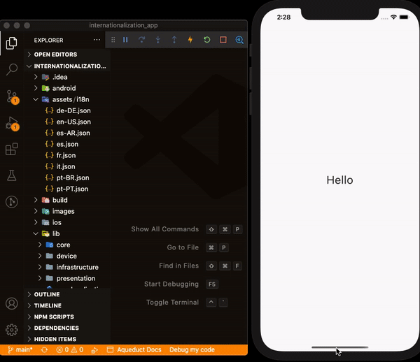

# Internacionalização com flutter

Quando um desenvolvedor planeja lançar um aplicativo móvel, disponibilizando-o em grandes plataformas como a Apple Store e a
Google Play Store, é perceptível que seu principal intuito é atingir o máximo número possível de usuários, independente se o aplicativo será pago ou não.

Caso o aplicativo seja pago, o objetivo principal é ganhar dinheiro. Caso contrário é obter portfólio e, quem sabe, conseguir algum investimento para voos maiores.

Tais lojas disponibilizam os produtos para o mundo todo. O idioma universal é o inglês. O espanhol também seu lado estratégico.

No caso do Brasil, existem alguns pontos um tanto quanto complicados em relação ao idioma. Ao contrário dos países vizinhos, onde quase todos tem o espanhol como nativo, falamos o português. Além disso, o subdesenvolvimento afeta diretamente a economia e a educação. A falta de dinheiro e a falta de tempo tentando suprir a falta de dinheiro, por exemplo, tornam-se grandes empecilhos no aprendizado de um segundo idioma, nesse caso o inglês.

Nessa ótica, lançar um aplicativo somente em inglês talvez satisfaça as necessidades do mundo, porém, pode ser um problema para o mercado interno, onde, em um primeiro momento, talvez seja o mercado mais tangível. Por outro lado, ao lançar um aplicativo somente em português, há a certeza de que o alcance de seu produto ficará seriamente comprometido.

Portanto, torna-se imprescindível que o aplicativo trabalhe com, ao menos, dois idiomas diferentes: O inglês e talvez o nativo do país onde o desenvolvedor está localizado. Se não forem iguais, óbvio.

O flutter nativamente possui bibliotecas com alguns termos (mais comumente usados em software) internacionalizados. Porém, os grandes atrativos em um aplicativo são as suas particularidades. Um aplicativo que usa e abusa do bom humor, por exemplo, conterá textos e mensagens engraçadas de acordo com a ação do usuário. Aplicativo voltado para usuários que sofrem de depressão conterá textos e mensagens que visam proporcionar alívio e bem-estar.

O aplicativo precisa ser customizado com o seu próprio conjunto de textos e mensagens traduzidos para mais de um idioma. Esse repositório visa apresentar uma aplicação pronta para trabalhar com tais customizações de acordo com as preferências.

## O Aplicativo

A construção usou o framework flutter. O flutter_modular foi usado para a injeção de dependências e definição de rotas. Apesar de haver apenas uma, a aplicação está preparada para receber outras. Além disso, houve um esforço para separar as responsabilidades o máximo possível, possibilitando cobrir boa parte da aplicação com testes.

### Arquivo json

Cada arquivo json adicionado contém textos e mensagens de um determinado idioma, identificado através do nome do arquivo. Por exemplo, o português é identificado através da palavra **pt**. No entanto, o português é um idioma falado em mais de um país, como Portugal e Brasil, por exemplo, com suas diferenças e peculiaridades. Caso o desenvolvedor queira que tais diferenças estejam no aplicativo, basta complementar o idioma com o código do país em letras maíusculas, separados o hífen. Por exemplo, para o português de Portugal teremos o arquivo **pt-PT.json** e para o Brasil teremos o arquivo **pt-BR.json**.

### Escolha do idioma

O idioma usado no aplicativo é baseado no idioma do dispositivo, dadas as seguintes circunstâncias:

- **Idioma e país estão na aplicação:** é o caso mais simples. O dispositivo do usuário está configurado com o idioma **português do Brasil**. Portanto, nesse caso, os textos e mensagens serão oriundos do arquivo **pt-BR.json**.

  

- **Somente idioma está na aplicação:** temos o arquivo **fr.json**, com o idioma francês. É a única opção de francês e repare que esse arquivo contém somente o idioma, sem especificar o país. Portanto qualquer idioma francês escolhido, independente do país, usará esse arquivo para tradução.

  

- **Idioma e país estão na aplicação, mas nenhum com o país do dispositivo:** este é um exemplo um pouco mais complexo. Vamos usar como exemplo o idioma espanhol. Temos duas opções: o espanhol original, o **es.json**, e o espanhol argentino, o **es-AR.json**. Caso o dispositivo esteja configurado para o **espanhol colombiano**, a preferência sempre será o idioma original, nesse caso o **es.json**. Mesmo critério se, ao invés de **es.json**, o arquivo fosse **es-ES.json**, ou seja, o país traduz o berço do idioma, portanto, a preferência será o **es-ES.json**. No entanto, nesse caso, aconselha-se o uso somente do idioma.

    

- **Idioma não está na aplicação:** automaticamente o idioma escolhido será o inglês americano **(en-US.json)**.

  

### Adicionar novos idiomas

A ideia do aplicativo é bem simples. Basta adicionar em **assets/i18n** o arquivo json com os textos e mensagens traduzidos no respectivo idioma (e país se for o caso) e reiniciar a aplicação sem a necessidade de alterar código, nem o arquivo **pubspec.yaml**. Nos testes o _hot restart_ foi suficiente ao adicionar um novo arquivo. No entanto, ao remover um arquivo é necessário parar a aplicação e iniciá-la novamente.



## Teste de integração

Testes de integração são testes realizados diretamente nos dispositivos e emuladores. Portanto, antes de executar o comando abaixo, é necessário que algum dispositivo esteja conectado no computador, via usb por exemplo, ou que algum emulador esteja em execução. Os dispositivos e emuladores podem ser tanto de iOS quanto de Android.

```console
flutter drive --driver=test_driver/integration_test.dart --target=test_integration/app_widget_test.dart
```

Para maiores detalhes consulte o pacote <https://pub.dev/packages/integration_test>
